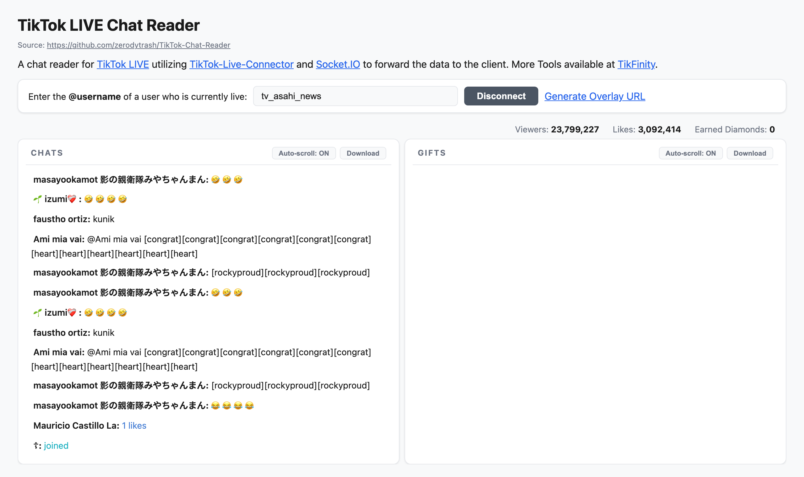

<div align="center">

# TikTok Live Spy

**实时捕捉 TikTok 直播间的弹幕、礼物与互动数据 · Real-time capture of TikTok LIVE chat, gifts & engagement**

[**English**](README.md) · [中文](README.zh-CN.md)



</div>

---

## Overview

**TikTok Live Spy** connects to any public TikTok LIVE room and streams its real-time
events — chat comments, gifts, likes, follows, shares, and member joins — to a clean
web dashboard. It is built for monitoring and analyzing live-stream engagement, and is
designed as a single, self-contained codebase you can freely customize and extend.

Under the hood it merges two upstream projects by [@zerodytrash](https://github.com/zerodytrash):
the **[TikTok-Live-Connector](https://github.com/zerodytrash/TikTok-Live-Connector)** library
(vendored locally so you can edit and rebuild it) and the
**[TikTok-Chat-Reader](https://github.com/zerodytrash/TikTok-Chat-Reader)** web app, then
adapts them to the latest connector (v2.x) with fixes for proxying, event serialization,
and field-mapping so everything works end-to-end out of the box.

## Features

- 🔴 **Live event stream** — chat, gifts, likes, follows, shares and joins in real time
- 📊 **Room stats** — concurrent viewers, total likes and earned diamonds
- 🎁 **Gift details** — gift name, diamond cost and icon (via the room gift list)
- 🧱 **Editable connector** — the TikTok connector lives in `connector/` as an npm workspace
- 🌐 **Proxy support** — route all TikTok traffic through your own proxy when needed
- 🖥️ **OBS overlay** — a transparent overlay page for browser sources

## Project structure

```
tiktok_live_spy/
├── server.js              # Express + Socket.IO backend
├── connectionWrapper.js   # Reconnect / error-handling wrapper around the connector
├── limiter.js             # Per-IP rate limiting
├── public/                # Frontend (index.html, app.js, connection.js, obs.html, style.css)
├── connector/             # Vendored TikTok-Live-Connector library (npm workspace)
│   └── src/               # Edit the connector here, then `npm run build:connector`
├── docs/                  # Screenshots and assets
├── .env.example           # Copy to .env and fill in your own settings
└── package.json           # Root app + workspace config
```

## Requirements

- [Node.js](https://nodejs.org/) >= 20

## Setup

```bash
# 1. Install dependencies (also builds the vendored connector)
npm install

# 2. Create your local config from the template
cp .env.example .env
#    then open .env and fill in the values (see Configuration below)

# 3. Start the server
npm start
```

Open <http://localhost:8081> and enter the **@username** of a user who is currently live.

## Configuration

All configuration lives in `.env` (which is **git-ignored** — never commit it). Copy
`.env.example` and fill in your own values:

| Variable | Required | Description |
|----------|----------|-------------|
| `PORT` | No | Web server port (default `8081`) |
| `API_KEY` | Recommended | Your own [Euler Stream](https://www.eulerstream.com/) API key, used to sign requests for reliable connections. Get a free key from their site. |
| `PROXY` | When needed | Proxy URL for all TikTok traffic (e.g. `http://127.0.0.1:7897`). Required if your network can't reach TikTok directly. |
| `SESSIONID` | No | A TikTok `sessionid` cookie, for streams that require login |
| `ENABLE_RATE_LIMIT` | No | Set to any non-empty value to enable per-IP rate limiting |
| `RECAPTCHA_SITE_KEY` / `RECAPTCHA_SECRET_KEY` | No | Google reCAPTCHA v2 keys to gate connections |

> **Keep your secrets private.** `API_KEY`, `SESSIONID` and reCAPTCHA secrets are
> personal credentials — store them only in your local `.env`, never in source control.

## Development

| Command | Description |
|---------|-------------|
| `npm start` | Run the server |
| `npm run dev` | Run with `--watch` (auto-restart on changes) |
| `npm run build:connector` | Rebuild the vendored connector after editing `connector/src` |

The `/obs.html` page provides a transparent overlay suitable for OBS browser sources.

## How it works

```
Browser  ⇄  Socket.IO  ⇄  server.js  ⇄  connector (proxy)  ⇄  TikTok LIVE
```

The backend opens a connection to the TikTok LIVE room through the connector (optionally
via your proxy and Euler Stream signing), normalizes and sanitizes each event, and
forwards it to the browser over Socket.IO, where the frontend renders it.

## Notes & limitations

- TikTok's unofficial API can rate-limit or block server IPs. An Euler Stream `API_KEY`
  makes connections far more reliable.
- TikTok no longer includes user **avatars** in most live events, so chat avatars may be
  blank by design. Gift/avatar images load directly from TikTok's CDN in your browser and
  may not load on networks where that CDN is blocked.
- This project uses an unofficial reverse-engineered API and is intended for educational
  and analytical use.

## Credits

Both upstream projects are by [@zerodytrash](https://github.com/zerodytrash) and are MIT
licensed. This repository combines and adapts them.

## License

MIT
